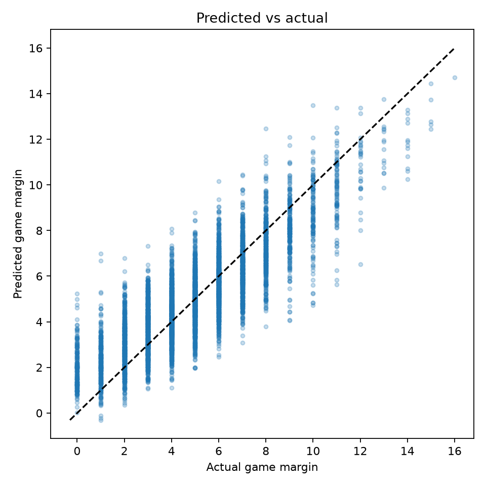
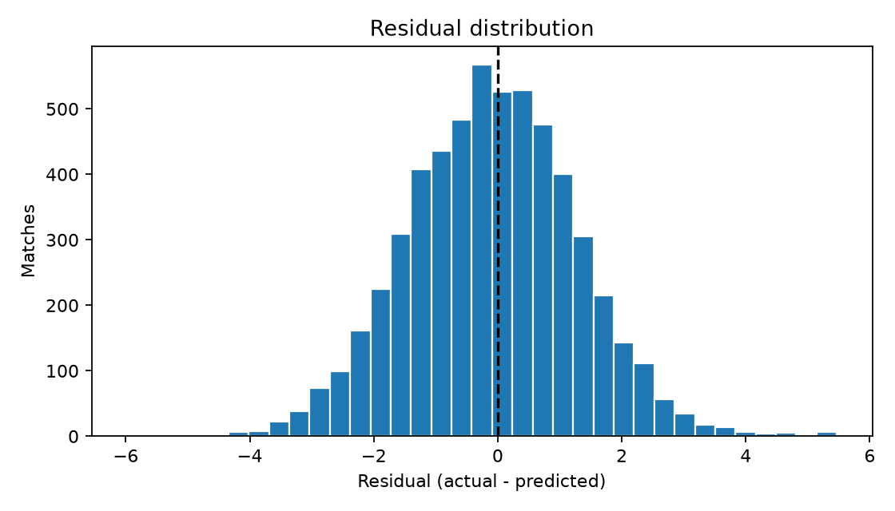
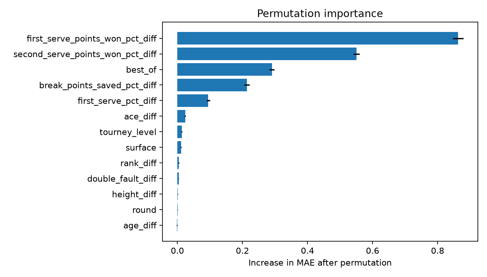

# ATP Serve Performance and Final Game Margin

## Project overview

This repository contains a post-match explanatory regression analysis of men's
professional tennis. It studies how serve performance observed during a match
is associated with the final game margin.

The original university/Kaggle notebook is preserved unchanged in
`notebooks/original/`. The production pipeline corrects its score parser,
prevents temporal leakage, introduces naive baselines, and separates model
selection from final test evaluation.

## Research question

> How is in-match serve performance associated with the final game margin in
> professional ATP tennis?

## Why this is not pre-match forecasting

The primary features are statistics collected during the completed match.
Moreover, the source data already identify the winner and loser. The model does
not forecast a future winner and must not be used as a pre-match prediction
system. It explains variation in the magnitude of the eventual winner's game
advantage.

This is also an observational analysis. Associations, SHAP values, and feature
importance do not demonstrate that changing a serve statistic would cause a
different result.

## Dataset

The pipeline accepts Jeff Sackmann-style `atp_matches_*.csv` files. Raw data are
not distributed here. See [`data/README.md`](data/README.md) for the expected
schema and recovery instructions.

The supplied archive contains 25 yearly files covering 2000–2024: 74,906
matches and 49 source columns (50 after parsing the date). The audit found no
exact duplicates and no duplicate `(tourney_id, match_num)` keys.

## Target definition

For a completed and interpretable score:

```text
game_margin = winner_games - loser_games
```

The score is recorded from the match winner's perspective. A set such as `3-6`
must therefore contribute three games to the eventual winner and six to the
eventual loser. Tie-break points in parentheses are ignored because they are not
games.

`game_margin` is non-negative by the project's target definition, not by a law
of tennis: 1,349 completed matches were won despite a negative total-games
margin and are explicitly excluded. Walkovers, retirements,
defaults, incomplete scores, missing scores, and unsupported formats receive an
explicit status and are excluded rather than assigned an invented margin.

The parser found 71,630 completed standard scores and retained 70,281 matches.
The other exclusions include 2,224 retirements, 384 walkovers, 159 match
tie-break formats, 445 incomplete scores, and 64 unparseable scores.

## Feature engineering

The primary serve-only group contains:

- ace difference;
- double-fault advantage (loser minus winner, so positive is favorable);
- first-serve percentage difference;
- first-serve points-won percentage difference;
- second-serve points-won percentage difference;
- break-points-saved percentage difference.

Undefined ratios remain missing. A zero denominator is not converted to 0%,
because “no opportunity” is not the same as zero success.

Experiments use three groups: `serve`, `other`, and `combined`. Every principal
comparison uses the same eligible match population, and missing features are
handled inside train-fitted pipelines. Final match duration is excluded because
it is structurally too close to the number of sets and games in the target.

## Temporal split

The primary evaluation is chronological. By default:

- all early years are training data;
- the two years before the test period are validation data;
- the two most recent years are the untouched test data.

The realized split contains 59,260 training matches (2000–2020), 5,323
validation matches (2021–2022), and 5,698 untouched test matches (2023–2024).
Automated tests enforce:

```text
max(train_date) < min(validation_date) < min(test_date)
```

Model family and feature group are selected by validation MAE. The test period
is evaluated only by `scripts/evaluate.py` after selection is complete.

## Models and baselines

The comparison starts with simple references:

1. mean DummyRegressor;
2. median DummyRegressor;
3. Linear Regression;
4. Ridge Regression;
5. Random Forest;
6. XGBoost when the optional dependency is installed.

Imputation, scaling, and one-hot encoding are implemented through scikit-learn
`Pipeline` and `ColumnTransformer` objects fit only on training data.

## Results

XGBoost with the combined feature group was selected solely on validation MAE.

| Feature group / model | Validation MAE |
|---|---:|
| Combined / XGBoost | 1.070 |
| Combined / Random Forest | 1.099 |
| Combined / Linear Regression | 1.158 |
| Serve only / XGBoost | 1.288 |
| Other match features / XGBoost | 1.885 |
| Median baseline | 2.000 |

On the 2023–2024 test period (5,698 matches), the selected model obtained MAE
**1.084 games** (bootstrap 95% CI 1.064–1.105), RMSE **1.368**, and R² **0.713**
(bootstrap 95% CI 0.699–0.727). Full-precision results are in
`reports/metrics.json`; all candidate results are in
`reports/model_comparison.csv`.





## Explainability

Permutation importance identifies first-serve and second-serve points-won
differences as the strongest model inputs, followed by match format. This is
expected because these are post-match aggregates structurally related to games
won; it is not evidence of causal effect. SHAP is optional and was not required
for the reported run.



> SHAP explains how the trained model uses each feature; it does not establish
> a causal relationship between serve statistics and match outcomes.

## Error analysis

The evaluation script creates:

- predicted versus actual game margin;
- residual distribution;
- residuals versus predictions;
- MAE summaries by surface;
- errors by test year;
- errors for best-of-three versus best-of-five matches;
- bootstrap 95% intervals for MAE and R².

The intended compact README figures are `target_distribution.png`,
`predicted_vs_actual.png`, `residual_distribution.png`, and—when available—one
explainability figure. They are not embedded until generated from real data.

## Limitations

- This is post-match explanation, not forecasting.
- Winner/loser orientation is known when features are created.
- Observational importance is not causal impact.
- Score formats outside the supported grammar are excluded and audited.
- Missing serve opportunities may reduce information for some matches.
- Era, equipment, surfaces, and tournament formats can create distribution
  shift across time.
- A model based on aggregate match statistics cannot explain point-level
  dynamics.

The rerun of K-Means selected k=2 with a sampled silhouette score of 0.153,
indicating weak separation. It is retained only as optional exploratory work;
the clusters are match-level patterns, not stable player archetypes.

## Reproduction

```bash
python -m venv .venv
# Windows: .venv\Scripts\activate
# Linux/macOS: source .venv/bin/activate
python -m pip install -e ".[dev]"
python scripts/train.py --data-dir data/raw
python scripts/evaluate.py --data-dir data/raw
pytest
```

Install optional models/explanations with:

```bash
python -m pip install -e ".[xgboost,explain]"
```

## Repository structure

```text
├── README.md
├── REFACTOR_PLAN.md
├── pyproject.toml
├── data/
├── notebooks/
│   ├── original/
│   ├── 01_eda.ipynb
│   ├── 02_results.ipynb
│   └── 03_exploratory_player_profiles.ipynb
├── src/tennis_analysis/
├── scripts/
├── tests/
├── reports/
└── .github/workflows/tests.yml
```
